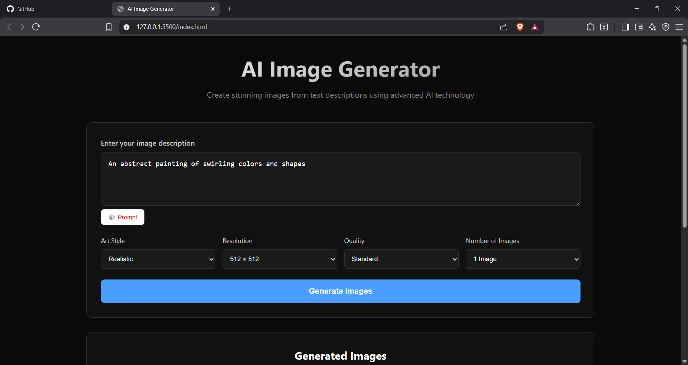
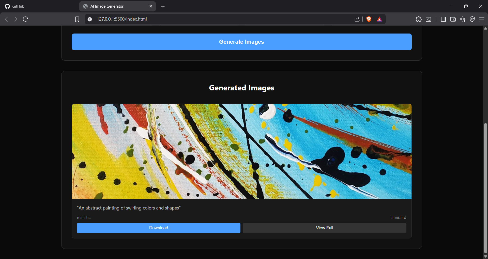

# AI Image Generator

A sleek, dark-themed web app that generates images from text prompts. Users describe an image, choose an art style, resolution, and quality, and the app searches the [Unsplash API](https://unsplash.com/developers) to surface matching high-quality photos styled and presented as AI-generated results.


## 📸 Preview




## ✨ Features

- **Prompt-based search** — describe what you want to see and the app fetches matching images
- **🎲 Random Prompt generator** — instantly fills the input with a random curated prompt for inspiration
- **Customizable controls** — choose art style (Realistic, Artistic, Cartoon, Abstract, Cyberpunk, Vintage), resolution, quality, and number of images
- **Dynamic results grid** — images render into a responsive card grid with the prompt, style, and quality shown for each
- **Download button** — save any generated image directly to your device
- **Full-size preview modal** — click "View Full" to open an image in a lightbox-style overlay
- **Loading and status messages** — clear feedback for in-progress, successful, and failed requests
- **Error handling** — gracefully handles failed requests, empty results, and broken image links
- **Fully responsive layout** — adapts cleanly from desktop to mobile

## 🛠️ Tech Stack

- **HTML5** — semantic structure
- **CSS3** — dark UI theme, CSS Grid, responsive layout, custom animations
- **JavaScript (ES6)** — Fetch API, async/await, dynamic DOM manipulation, event handling
- **API** — [Unsplash API](https://unsplash.com/developers) (Search Photos endpoint)

## 📁 Project Structure

```
AI-Image-Generator/
├── index.html
├── style.css
├── script.js
├── screenshot-1.png
├── screenshot-2.png
└── README.md
```

## 🚀 Getting Started

### Prerequisites

- A free [Unsplash Developer](https://unsplash.com/developers) account and API access key
- A modern web browser — no build tools required

### Installation

1. Clone the repository
   ```bash
   git clone https://github.com/Rakshit588/AI-Image-Generator.git
   ```
2. Navigate into the project folder
   ```bash
   cd AI-Image-Generator
   ```
3. Open `script.js` and add your own Unsplash API access key
4. Open `index.html` in your browser, or use a live server extension (e.g. VS Code's Live Server) for the best experience

## 🕹️ How It Works

1. Enter a description in the prompt box, or click **🎲 Prompt** to auto-fill a random one
2. Choose your preferred art style, resolution, quality, and number of images
3. Click **Generate Images** (or press `Ctrl + Enter` in the prompt box)
4. The app combines your prompt, style, and quality into a search query sent to the Unsplash API
5. Matching photos are rendered into a card grid, each with a **Download** and **View Full** option

## 💡 What I Learned

Building this project helped me practice:

- Making asynchronous API requests with `fetch` and `async/await`
- Building dynamic, data-driven UI with native JavaScript DOM methods
- Managing UI state (loading, disabled buttons, spinners) during async operations
- Handling errors gracefully — failed requests, empty results, broken images
- Creating reusable UI patterns like modals and dismissible status messages
- Designing a clean, modern dark-mode interface with CSS Grid and custom animations

## 🔮 Future Improvements

- [ ] Move the API key out of client-side code for safer deployment
- [ ] Add pagination or "load more" for search results
- [ ] Add a history/gallery of previously generated searches
- [ ] Add a light/dark theme toggle
- [ ] Replace Unsplash search with an actual text-to-image generation API (e.g. Stability AI, Hugging Face)

## 👤 Author

**Rakshit Singh**
- GitHub: [@Rakshit588](https://github.com/Rakshit588)
- LinkedIn: [rakshit-singh-9a5091367](https://www.linkedin.com/in/rakshit-singh-9a5091367)
- Email: rakshitsingh588@gmail.com

## 📄 License

This project is open source and available under the [MIT License](LICENSE).
